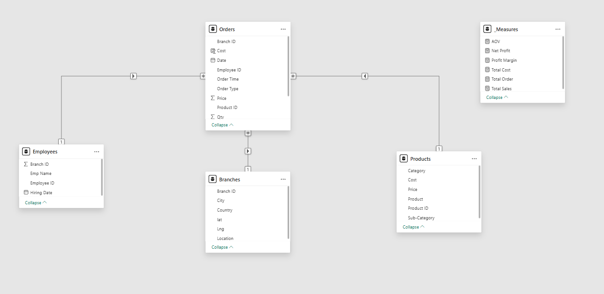
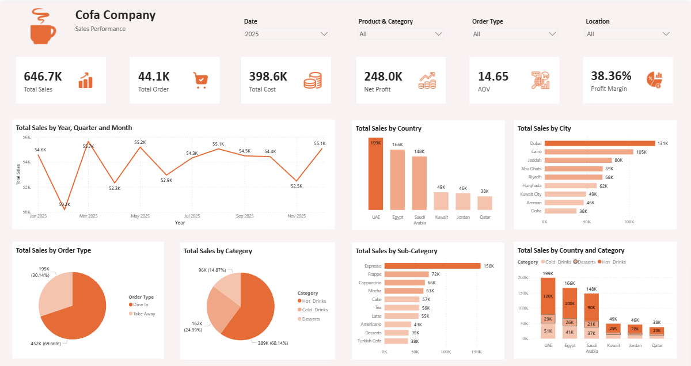

# ✈️ Airport Coffee Shop Sales Performance Analysis

## 📌 Project Overview
This project presents an end-to-end data analysis and business intelligence solution for a global coffee shop chain operating in multiple international airports. The goal is to analyze sales performance across 2025, uncover peak hours, evaluate branch profitability, and understand customer purchasing behavior (Dine-in vs. Take Away).

*This project was developed as a practical application of Data Analysis and Microsoft Power BI skills acquired during the Digital Egypt Pioneers Initiative (DEPI) scholarship.*

## 👤 Author
**Gad**
*Mechatronics Engineering Student | Data Analyst*

## 🗂️ Dataset Description
The dataset represents a full year of transactions (2025) and consists of:
* **Fact Tables:** 4 separate CSV files representing quarterly daily transactions (`Q1-2025` to `Q4-2025`).
* **Dimension Tables:** `Products_Data`, `Branches_Data` (including Geolocation data), and `Employees_Data`.

## ⚙️ Data Preparation & Modeling
* **Data Consolidation:** Appended the 4 quarterly transactional files into one unified `Sales_Fact` table using Power Query.
* **Data Modeling:** Designed a robust **Star Schema** (1-to-Many relationships) connecting the centralized Fact table with the Dimension tables.
* **Date Dimension:** Created a custom Calendar table to enable Time Intelligence analysis.

 *(Note: Update the image path to match your repository)*

## 🧮 Key DAX Measures
Developed optimized DAX measures to track essential business KPIs:
* **Total Sales:** `SUMX('Orders', 'Orders'[Qty] * 'Orders'[Price])`
* **Total Cost:** `SUMX('Orders', 'Orders'[Qty] * RELATED('Products'[Cost]))`
* **Net Profit:** `[Total Sales] - [Total Cost]`
* **Profit Margin:** `DIVIDE([Net Profit], [Total Sales], 0)`
* **Average Order Value (AOV):** `DIVIDE([Total Sales], [Total Orders], 0)`

## 📊 Dashboard & Insights
The interactive Power BI dashboard provides actionable insights into:
1.  **Revenue & Profitability:** Tracking overall sales and profit margins.
2.  **Product Performance:** Identifying top-selling items and their respective categories.
3.  **Branch Analysis:** Comparing transaction volumes and sales across different airport locations.

 *(Note: Update the image path to match your repository)*

## 🛠️ Tools & Technologies Used
* **Microsoft Power BI:** Data Modeling, DAX, and Data Visualization.
* **Power Query:** Data cleaning and transformation.
